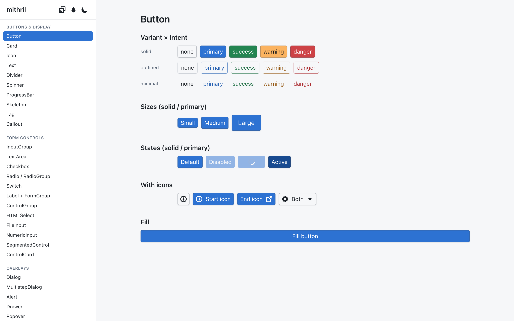
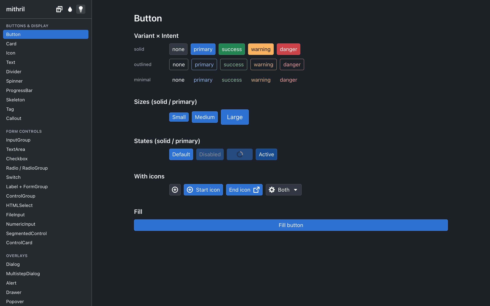
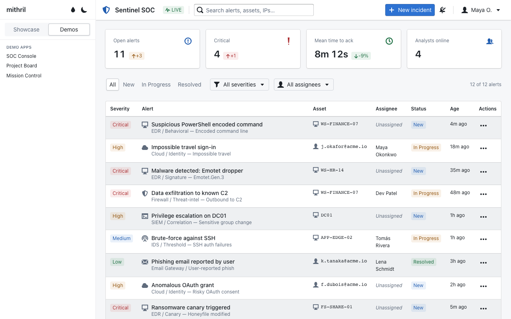
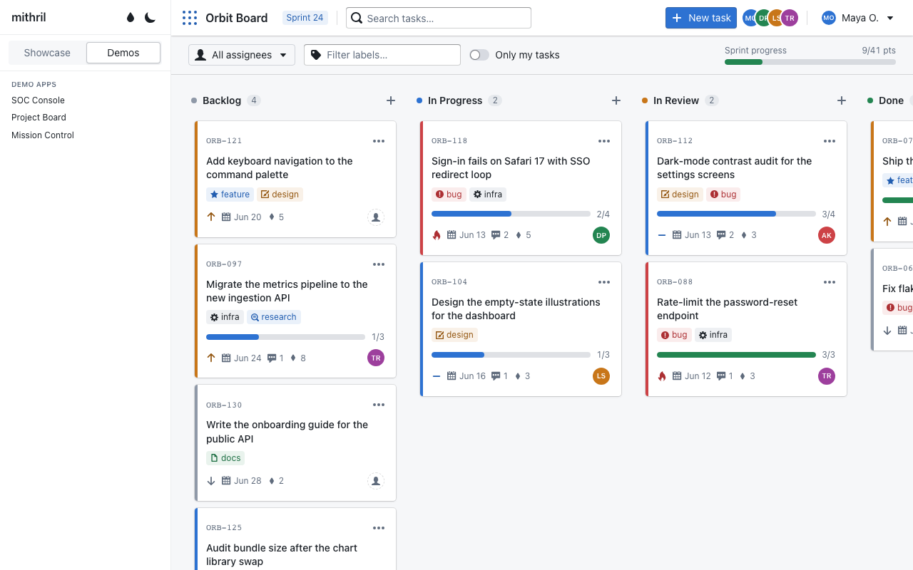
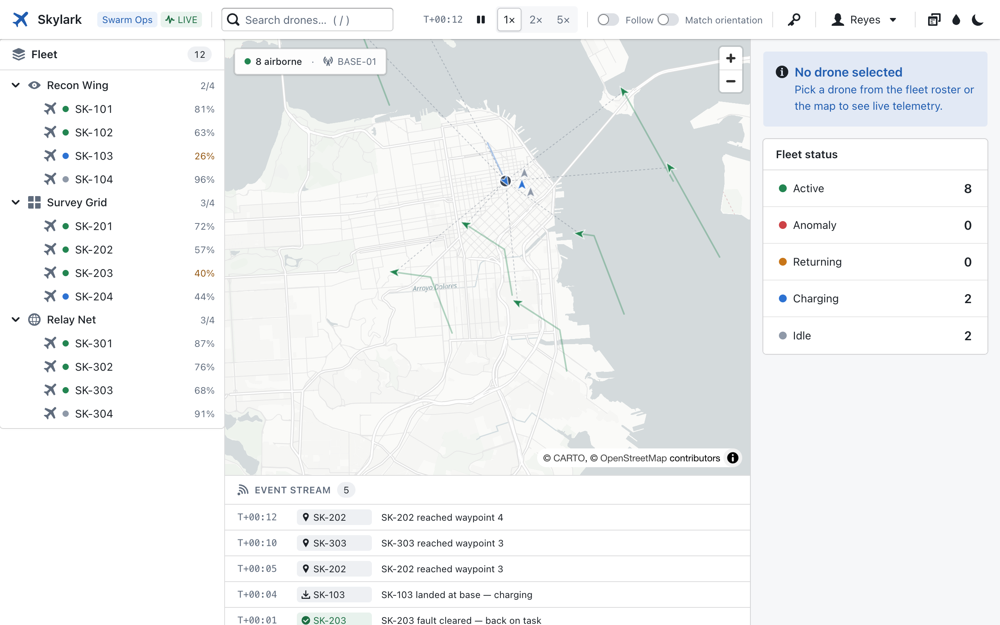

# mithril

**A reforging of Palantir's 'blueprint' library/design language** into a modern, owned-source component library. Targets React 19 + Tailwind v4, built on Radix, designed to be installed shadcn style.

> This library is an experiment in agent-mediated code built by long-horizon autonomous agent loops, with no human reading the code. [The experiment](#the-experiment).

🔗 **Live demo:** <https://bbatchelder.github.io/mithril/>

---

## Preview

The component gallery — light and dark themes (`pnpm dev`, or the [live demo](https://bbatchelder.github.io/mithril/)):

[](docs/assets/gallery-light.png) [](docs/assets/gallery-dark.png)

### Demo apps

Three mocked up applications built with mithril (in the gallery under the **Demos** tab):

| [SOC Console](https://bbatchelder.github.io/mithril/#demo-soc) | [Project Board](https://bbatchelder.github.io/mithril/#demo-board) | [Mission Control](https://bbatchelder.github.io/mithril/#demo-mission) |
| --- | --- | --- |
| [](docs/assets/demo-soc.png) | [](docs/assets/demo-board.png) | [](docs/assets/demo-mission.png) |
| Security-alert triage console | Kanban project board | Live drone-swarm telemetry + MapLibre map |

---

## What it is

A modern, owned-source library that reproduces the visual DNA — color, density, elevation, typography, motion — from Palantir's 'blueprint', but on a contemporary stack:

- **React 19** + TypeScript
- **Tailwind v4** (CSS-first `@theme`) + **CVA** for variants
- **Radix UI** primitives under the overlay/positioning and tablist components (Dialog, Drawer, Alert, Popover, Tooltip, Toast, Slider, Tabs, ContextMenu); the rest are hand-rolled on native elements
- **TanStack Table** + **TanStack Virtual** under the `DataTable` grid (virtualized rows, selection, resize/reorder, editable cells)
- **No runtime icon dependency** — the full blueprint icon set (706 glyphs) is vendored and tree-shakes per glyph
- Distributed **shadcn-style**: you copy and **own** the component source, not pull in a black-box package

Blueprint **was** the baseline. Mithril is diverging from being a visual clone of blueprint. The project is **not** tracking blueprint's evolution and is **not** trying to stay faithful to future blueprint releases. v6.15 was the measurable target for [the experiment](#the-experiment); from here it's a starting point to evolve from, absorbing ideas from other design systems and adding original ones. Fidelity to blueprint was the *acceptance test for the build*, and it is expected (intended, even) to decay as the design language becomes its own thing.

> *On the name.* Continuing the Tolkien homage: mithril is **light** (this library aims to be a far lighter dependency than Blueprint — especially the CSS) and **malleable yet strong** — it can be beaten into new shapes without losing integrity, which is exactly the shadcn own-the-source bet: fork it, reshape it into your own language, and it doesn't fall apart. (In the legend it's also mined from a single source and then worked by many hands into many forms — a fitting image for one Blueprint-derived baseline, reforged by many agents.)

---

## Component catalog

| Group | Components |
| --- | --- |
| **Buttons & display** | Button · ButtonGroup · AnchorButton · Card · Icon · Text · Divider · Spinner · ProgressBar · Skeleton · Tag · Callout |
| **Form controls** | InputGroup · TextArea · Checkbox · Radio / RadioGroup · Switch · Label + FormGroup · ControlGroup · HTMLSelect · FileInput · NumericInput · SegmentedControl · ControlCard (CheckboxCard · RadioCard · SwitchCard) |
| **Overlays** | Dialog · MultistepDialog · Alert · Drawer · Popover · Tooltip · Toast · Menu · ContextMenu |
| **Navigation & structure** | Navbar · Tabs · Collapse · Section · CardList · Breadcrumbs · Tree · PanelStack · EditableText · EntityTitle · NonIdealState · Link · Slider · Hotkeys |
| **Tables & data grid** | HTMLTable · DataTable |
| **Composite selects** | TagInput · Select · Suggest · MultiSelect · Omnibar |
| **Date & time** | TimePicker · DatePicker · DateInput · DateRangePicker · DateRangeInput · TimezoneSelect |
| **Utilities** | Portal · OverflowList · ResizeSensor |

---

## Direction

Where this is headed (roadmap items, pursued in service of the author's own apps — not a product backlog with delivery promises):

- **Mobile.** Blueprint is expressly a desktop design language. A core goal here is to evolve the components and tokens so they're genuinely mobile-friendly — a deliberate departure from the baseline.
- **Charts & graphs.** Pull in a charting/graphing library and style/theme it to match, so data viz is a first-class, on-system citizen rather than a bolt-on.
- **Mapping.** Same treatment for a mapping library (the *Mission Control* demo already exercises MapLibre; the goal is a properly themed, on-system mapping story).
- **A coupled agent skill → a self-describing design system.** An agent skill is in development, tightly coupled to this repo, that teaches agents how to employ these components *correctly*. This is the natural endpoint of the experiment's own premise: an agent built this, so agents should be first-class consumers of it. The components plus the skill make the repo **self-describing** — the same place that holds the source also holds the instructions for composing it correctly. The skill will land in (or be linked from) this repo before any wider launch.

---

## Status & honest scope

Being upfront about exactly what this is:

- **Personal project, single author, no support.** This was built for the author's own use. There's no support commitment, the API may churn, and the design language will intentionally drift away from blueprint over time. Please don't file bugs expecting a maintained product.
- **Code is unreviewed by humans, by design.** See [the experiment](#the-experiment) — this is the premise, not an oversight. Correctness/behavior are test-guarded; code-level quality was never human-audited.
- **Younger and single-author vs. Blueprint.** Blueprint has years of production hardening, broader edge-case coverage, and `npm`-delivered bug/security fixes. The shadcn ownership model means *you* maintain copied source, with no upstream pushing fixes.
- **Tests are real but not exhaustive.** 341 keyboard/ARIA/behavior tests + axe smokes + the visual harness guard the common paths; they don't blanket every component and branch the way Blueprint's larger corpus does.
- **A few inherited Blueprint contrast deltas.** Some muted/disabled tones (the file-input prompt ~2.45:1 light / 3.75:1 dark; a Tree muted label ~4.2:1) were ported exactly from Blueprint and inherit its sub-AA contrast. These were conscious fidelity choices for the experiment; owning the source lets you darken the token if you need strict AA — and the move *away* from Blueprint is exactly where these get fixed.
- **Tailwind v4 required.** Components are styled with Tailwind v4 utility classes and are inert without it. Deliberate trade (it buys the tiny CSS and the token system); if you need framework-agnostic drop-in CSS, that's a reason to prefer Blueprint.
- **Data grid is newer than Blueprint's.** `DataTable` (TanStack-backed: row virtualization, selection, resize/reorder, editable cells, keyboard/clipboard) covers the common ground; Blueprint's `Table2` is a far larger, more battle-tested grid (column virtualization, frozen rows/cols).

---

## Getting started (run the gallery)

```
pnpm install
pnpm dev        # component gallery at http://localhost:5173
pnpm build      # typecheck + production build
pnpm typecheck
```

The gallery groups every component by category in a sidebar. Toggle light/dark from the header; deep-link to any component with a URL hash (e.g. `#button`).

### Example apps

Beyond the per-component gallery, the **Demos** toggle shows full example applications that compose the components into realistic product UIs (deep-link with `#demo-<id>`):

- **SOC Console** (`#demo-soc`) — a security-operations console: alert queue table, investigation drawer with tabs, filters, and toasts.
- **Project Board** (`#demo-board`) — a kanban board with drag-and-drop between columns, label/assignee filtering, a new-task dialog, and an inline-editable task detail panel.
- **Mission Control** (`#demo-mission`) — *Skylark*, a drone-swarm operations console with **live streaming data**: a [MapLibre](https://maplibre.org/) basemap (CARTO tiles, no API key) shows drones moving along patrol routes while telemetry and events stream from a seeded, deterministic mock-data engine. Exercises the structural slice — `Tree`, `Section`, `CardList`, `Skeleton`, `Breadcrumbs`, `PanelStack` — plus demo-local SVG sparklines and gauges. The only demo with a runtime dependency (`maplibre-gl`) and network calls (map tiles).

Each demo lives under `src/demos/<slug>/` and is registered in `src/demos/registry.ts`.

---

## Using the components yourself

You're welcome to. This was built for the author, but if it's useful to you, please use it, fork it, reshape it — that's what owning the source is for. Just go in with the honest deal above: it's a personal, single-author, no-support project whose design language will diverge from Blueprint over time.

mithril follows the shadcn model: you copy the source into your own project and own it from then on.

> **Prerequisite:** the components are styled with Tailwind v4 utility classes and are inert without it — your project must be on **Tailwind v4**.

### Install via the shadcn registry (recommended)

The registry is hosted at **`https://bbatchelder.github.io/mithril/r/`** — one entry per component, with its npm `dependencies` and cross-component `registryDependencies` (e.g. `Select` pulls in `Popover`, `Menu`, and `InputGroup`; everything pulls in the design tokens + `cn`) resolved automatically.

```
# 1. Direct URL — zero config:
npx shadcn@latest add https://bbatchelder.github.io/mithril/r/button.json
```

```
// 2. Namespaced — add this once to your components.json…
{
  "registries": {
    "@mithril": "https://bbatchelder.github.io/mithril/r/{name}.json"
  }
}
```

```
# …then install by short name (and tab-complete the rest):
npx shadcn@latest add @mithril/button @mithril/select
```

> Make sure `@import "tailwindcss";` is in your CSS before adding components (the `tokens` style is pulled in automatically as a dependency).

### Or copy the source by hand

The registry is just a convenience over copying files — you own the source either way:

1. Copy [`src/styles/tokens.css`](src/styles/tokens.css) into your project and `@import` it after Tailwind:

   ```
   @import "tailwindcss";
   @import "./styles/tokens.css";
   ```

2. Copy the `cn` helper ([`src/lib/utils.ts`](src/lib/utils.ts)) — most components import it.
3. Copy the component file(s) you want from [`src/components/ui/`](src/components/ui) and install their peer deps (each component's npm + cross-component dependencies are listed in [`registry.json`](registry.json), regenerated with `pnpm gen:registry`).

---

## Design tokens

[`src/styles/tokens.css`](src/styles/tokens.css) is the heart of the visual fidelity, following the shadcn + Tailwind v4 pattern:

1. **`@theme`** — static primitives that generate Tailwind utilities: full Blueprint palette (`gray`, `blue`, … `violet` × 1–5) → `bg-blue-3`, `text-gray-1`; theme-independent intents → `bg-primary`, `bg-success`, `bg-warning`, `bg-danger` (+ `-hover`/`-active`/`-disabled`/`-foreground`); type scale (`text-body`, `text-heading-lg`, `text-code`), `font-sans`/`font-mono`; radius (`rounded-bp`), easing (`ease-bp`, `ease-bp-bounce`).
2. **`:root` / `.dark`** — semantic variables that swap per theme: `--background`, `--surface`, `--elevated`, `--foreground(-muted/-disabled)`, `--border(-strong)`, `--divider`, `--ring`, elevation shadows, input shadow.
3. **`@theme inline`** — maps the semantic vars onto Tailwind tokens: `bg-background`, `bg-surface`, `text-foreground`, `border-border`, `shadow-elevation-{0..4}`.

Palette, intents, type, radius, motion, and elevation shadows are ported **1:1** from Blueprint's DTCG token set and SCSS variables; dark surface colors were verified against Blueprint's OKLCH-derived values.

> **Runtime-derivable & themeable.** Semantic tokens are derived at runtime from a small **seed** set (the four intent vars + the gray ramp) via CSS relative-color `oklch(from …)` / `color-mix()`, mirroring Blueprint's DTCG `derive` offsets — so overriding a seed on `<html>` re-tints the whole theme in both light and dark. Every derived value ships a static-literal `@supports` fallback. Several named themes ship as worked examples (`[data-theme="anthropic"]`, `"purple"`, …) and are switchable in the gallery; see [`docs/theming.md`](docs/theming.md).

> **Tailwind v4 tree-shakes unused `@theme` vars.** Reference tokens via *literal* utility classes (`bg-blue-3`, `shadow-elevation-2`, `ease-bp`), not runtime `var()` in inline styles — those get dropped.

---

## Dark mode

Class-based: put `.dark` (or `[data-mode="dark"]`) on an ancestor (a `@custom-variant dark` is declared in the tokens). The semantic CSS variables swap automatically; components built on token utilities follow along.

---

## The experiment

mithril wasn't hand-built. It came out of a long-horizon **goal loop** — Claude Code driving Claude Opus 4.8 — that carried the whole build with the human deliberately kept out of the code: humans set intent, architecture, and look/feel/behavior QA; agents wrote the code, the tests, and ran the harness; **no human read the implementation.** Blueprint v6.15 was chosen as the target precisely because pixel fidelity is *objectively measurable* — a hard pass/fail signal a falsifiable loop could run against across 171 commits.

📖 **The full story, the agent guide that governed the loop, and the 99 session handoffs live in [`docs/experiment/`](docs/experiment).**

---

## Project structure

```
src/
  components/ui/      the owned components (CVA + Radix)
  components/ui/icons/index.ts   706 Blueprint glyphs (generated by tools/gen-icons.mjs)
  styles/tokens.css   the design foundation
  styles/globals.css  Tailwind entry + animation keyframes + base layer
  lib/utils.ts        the cn() class-merge helper
  App.tsx             the gallery
docs/
  theming.md                    the runtime-derivable, seed-based token system
  experiment/                   the archived experiment: narrative + agent guide + roadmap + handoffs/
tools/
  gen-icons.mjs       regenerate the icon glyph map
  gen-registry.mjs    regenerate registry.json from source
  rewrite-registry-urls.mjs  post-process built items → URL deps (pnpm build:registry)
  compare.sh          screenshot + computed-style diff vs Blueprint
  blueprint-reference/  isolated Blueprint v6.15 gallery for side-by-side comparison
  comparison/         the comparison harness internals
```

---

## License

[Apache-2.0](LICENSE). Design tokens and visual design are ported from Palantir Blueprint (Apache-2.0); component implementations are original work. See [`NOTICE`](NOTICE).
